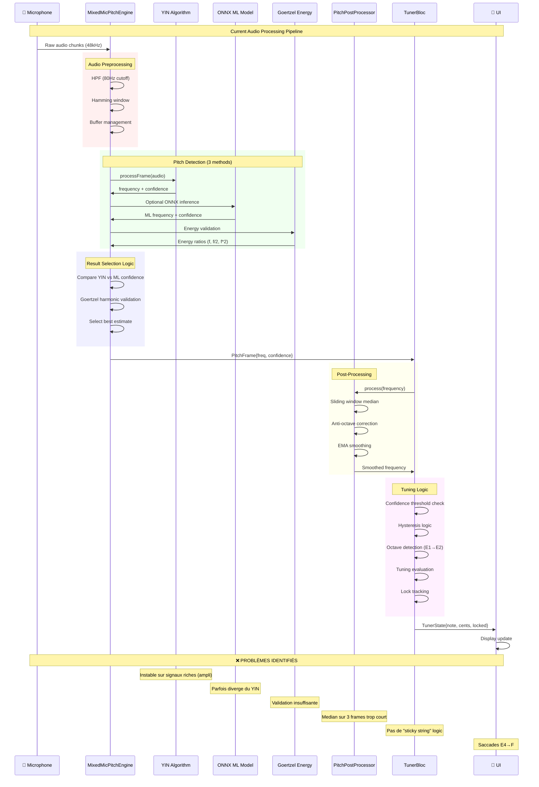

```mermaid
sequenceDiagram
    participant Mic as 🎤 Microphone
    participant Engine as MixedMicPitchEngine
    participant YIN as YIN Algorithm
    participant ML as ONNX ML Model
    participant Goertzel as Goertzel Energy
    participant Proc as PitchPostProcessor
    participant Bloc as TunerBloc
    participant UI as 📱 UI

    Note over Mic,UI: Current Audio Processing Pipeline

    Mic->>Engine: Raw audio chunks (48kHz)
    
    rect rgb(255,240,240)
        Note over Engine: Audio Preprocessing
        Engine->>Engine: HPF (80Hz cutoff)
        Engine->>Engine: Hamming window
        Engine->>Engine: Buffer management
    end

    rect rgb(240,255,240)
        Note over Engine,Goertzel: Pitch Detection (3 methods)
        Engine->>YIN: processFrame(audio)
        YIN->>Engine: frequency + confidence
        
        Engine->>ML: Optional ONNX inference
        ML->>Engine: ML frequency + confidence
        
        Engine->>Goertzel: Energy validation
        Goertzel->>Engine: Energy ratios (f, f/2, f*2)
    end

    rect rgb(240,240,255)
        Note over Engine: Result Selection Logic
        Engine->>Engine: Compare YIN vs ML confidence
        Engine->>Engine: Goertzel harmonic validation
        Engine->>Engine: Select best estimate
    end

    Engine->>Bloc: PitchFrame{freq, confidence}

    rect rgb(255,255,240)
        Note over Proc: Post-Processing
        Bloc->>Proc: process(frequency)
        Proc->>Proc: Sliding window median
        Proc->>Proc: Anti-octave correction
        Proc->>Proc: EMA smoothing
        Proc->>Bloc: Smoothed frequency
    end

    rect rgb(255,240,255)
        Note over Bloc: Tuning Logic
        Bloc->>Bloc: Confidence threshold check
        Bloc->>Bloc: Hysteresis logic
        Bloc->>Bloc: Octave detection (E1→E2)
        Bloc->>Bloc: Tuning evaluation
        Bloc->>Bloc: Lock tracking
    end

    Bloc->>UI: TunerState{note, cents, locked}
    UI->>UI: Display update

    Note over Mic,UI: ❌ PROBLÈMES IDENTIFIÉS
    Note over YIN: Instable sur signaux riches (ampli)
    Note over ML: Parfois diverge du YIN
    Note over Goertzel: Validation insuffisante  
    Note over Proc: Median sur 3 frames trop court
    Note over Bloc: Pas de "sticky string" logic
    Note over UI: Saccades E4→F#3→E3→C4
```